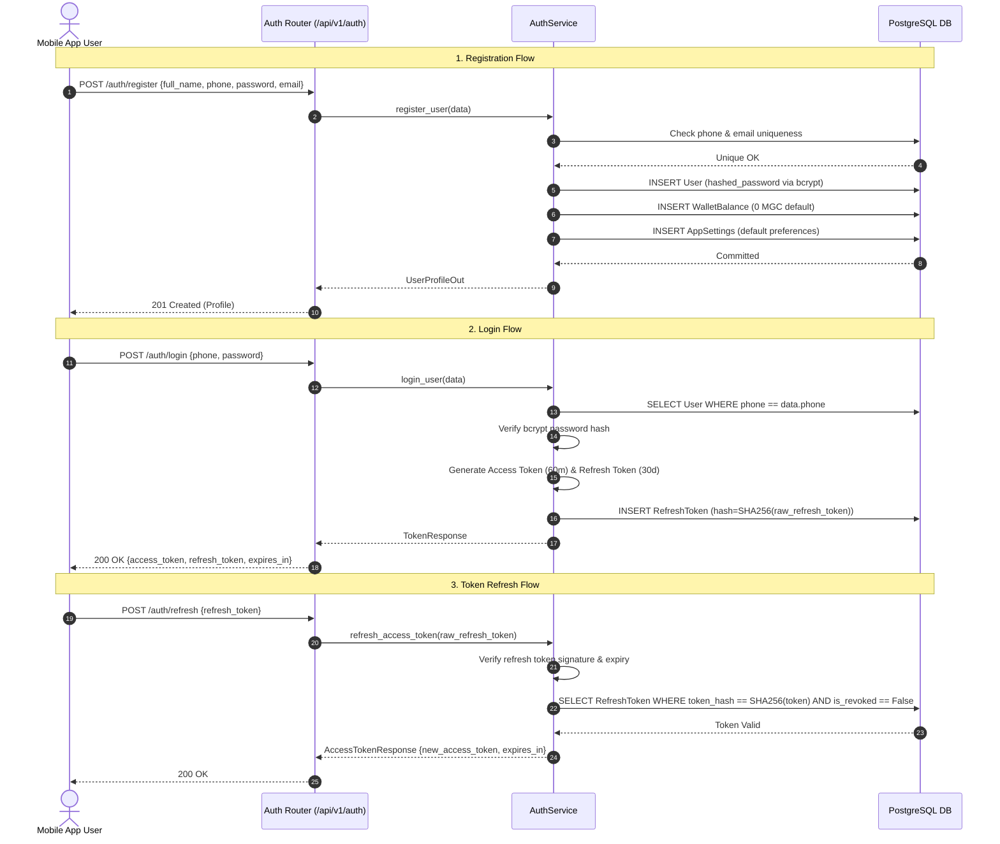
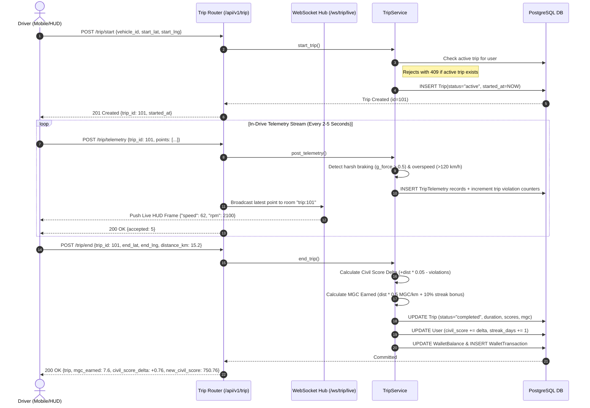
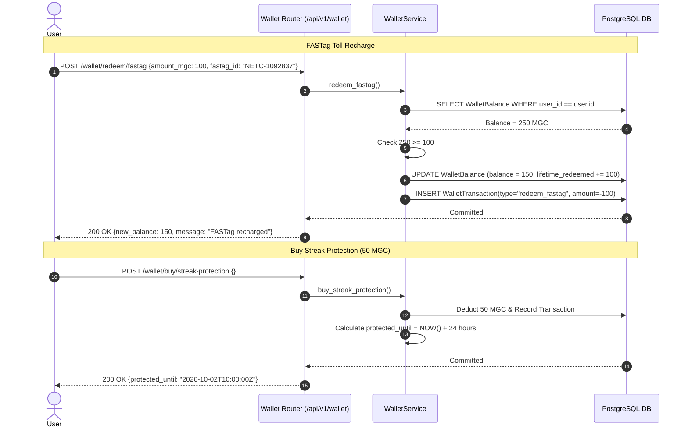
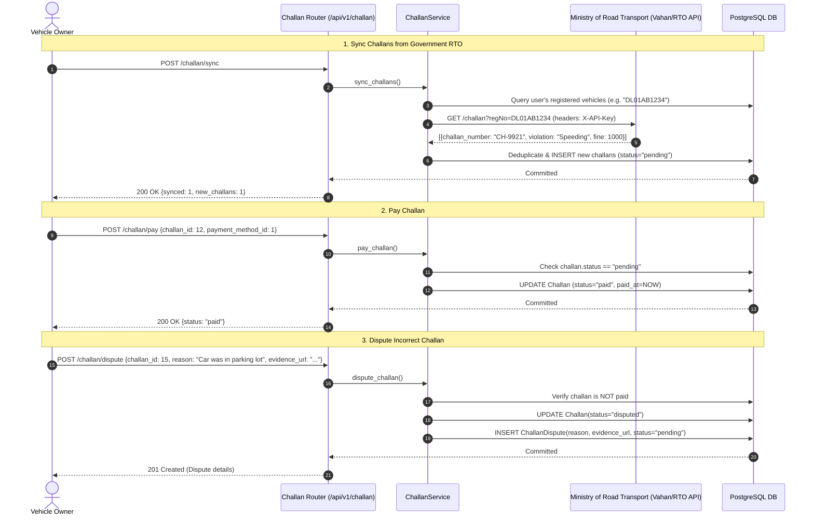
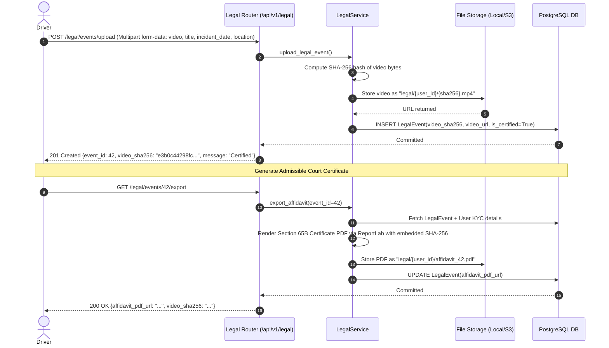
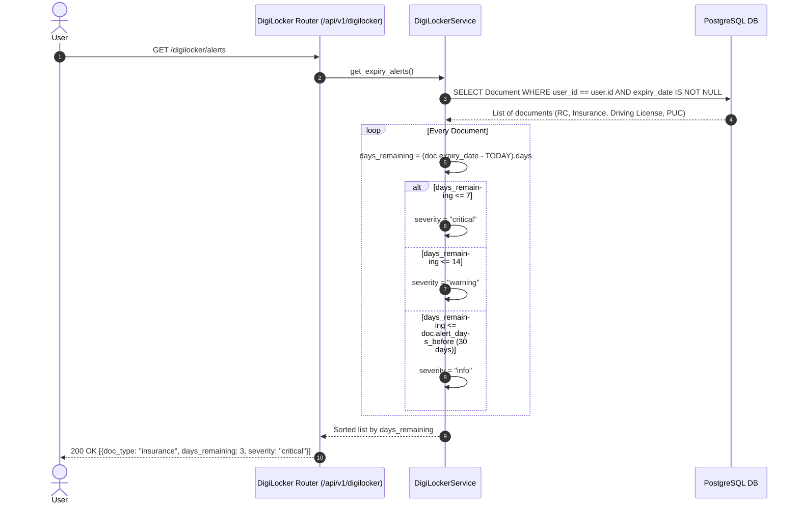
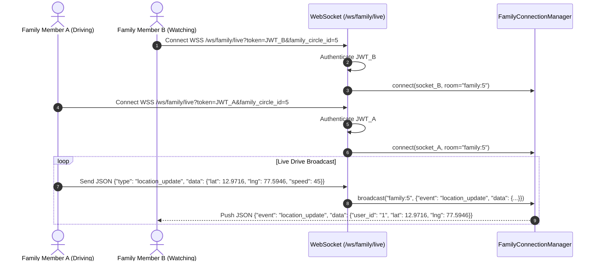
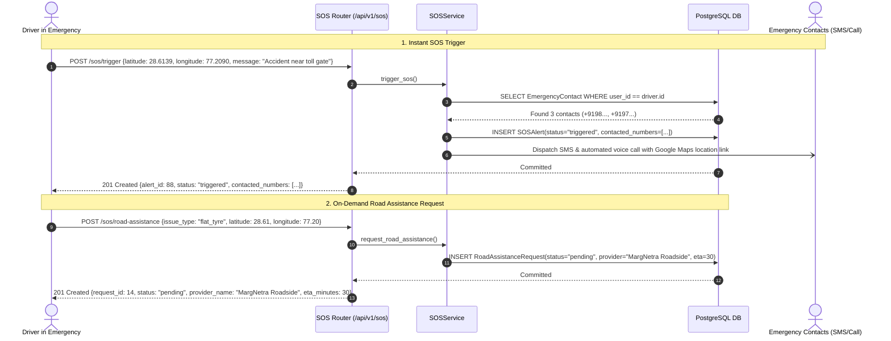
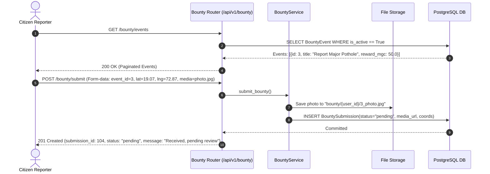

# 🧭 MargNetra Super App — Complete API Reference & Flow Guide

> **Version:** 1.0.0  
> **Framework:** FastAPI (Python 3.11+)  
> **Base URL:** `http://localhost:8000` (Local) / `https://api.margnetra.com` (Production)  
> **API Prefix:** `/api/v1`  
> **Interactive Docs:** Swagger UI at [`/docs`](http://localhost:8000/docs) | ReDoc at [`/redoc`](http://localhost:8000/redoc)

---

## 📑 Table of Contents

1. [Architectural Overview & Core Concepts](#1-architectural-overview--core-concepts)
2. [Global Standards & Conventions](#2-global-standards--conventions)
   - [Authentication & JWT Headers](#authentication--jwt-headers)
   - [Pagination Envelope](#pagination-envelope)
   - [Standard Error Envelope](#standard-error-envelope)
   - [Rate Limiting](#rate-limiting)
   - [File Storage (Local vs S3)](#file-storage-local-vs-s3)
3. [End-to-End System Flow Diagrams (Mermaid)](#3-end-to-end-system-flow-diagrams-mermaid)
   - [Flow 1: User Registration, Authentication & Token Refresh](#flow-1-user-registration-authentication--token-refresh)
   - [Flow 2: Driving Trip Lifecycle, Telemetry Ingestion & Scoring Engine](#flow-2-driving-trip-lifecycle-telemetry-ingestion--scoring-engine)
   - [Flow 3: MGC Tokenomics, FASTag Redemption & Streak Protection](#flow-3-mgc-tokenomics-fastag-redemption--streak-protection)
   - [Flow 4: e-Challan Sync, Payment & Dispute Lifecycle](#flow-4-e-challan-sync-payment--dispute-lifecycle)
   - [Flow 5: Legal Vault Dashcam Evidence & Section 65B Certification](#flow-5-legal-vault-dashcam-evidence--section-65b-certification)
   - [Flow 6: DigiLocker Document Expiry Watchdog](#flow-6-digilocker-document-expiry-watchdog)
   - [Flow 7: Family Circle Live Location Tracking (WebSocket)](#flow-7-family-circle-live-location-tracking-websocket)
   - [Flow 8: Emergency SOS & Roadside Breakdown Dispatch](#flow-8-emergency-sos--roadside-breakdown-dispatch)
   - [Flow 9: Bounty Capture & Civic Rewards Flow](#flow-9-bounty-capture--civic-rewards-flow)
4. [Exhaustive API Endpoint Reference (Individually Detailed)](#4-exhaustive-api-endpoint-reference-individually-detailed)
   - [4.1 System & Health](#41-system--health)
   - [4.2 Authentication & Security (`/api/v1/auth`)](#42-authentication--security-apiv1auth)
   - [4.3 User Profile, Vehicles & Settings (`/api/v1/user`)](#43-user-profile-vehicles--settings-apiv1user)
   - [4.4 Marg Coin (MGC) Wallet (`/api/v1/wallet`)](#44-marg-coin-mgc-wallet-apiv1wallet)
   - [4.5 Driving Trips & Telemetry HUD (`/api/v1/trip`)](#45-driving-trips--telemetry-hud-apiv1trip)
   - [4.6 e-Challan Management (`/api/v1/challan`)](#46-e-challan-management-apiv1challan)
   - [4.7 Legal Vault & Section 65B (`/api/v1/legal`)](#47-legal-vault--section-65b-apiv1legal)
   - [4.8 DigiLocker Document Vault (`/api/v1/digilocker`)](#48-digilocker-document-vault-apiv1digilocker)
   - [4.9 Family Circle & Safety (`/api/v1/family`)](#49-family-circle--safety-apiv1family)
   - [4.10 Emergency SOS & Road Assistance (`/api/v1/sos`)](#410-emergency-sos--road-assistance-apiv1sos)
   - [4.11 Bounty Capture (`/api/v1/bounty`)](#411-bounty-capture-apiv1bounty)
   - [4.12 Hardware Devices (BLE / OBD / Dashcam) (`/api/v1/devices`)](#412-hardware-devices-ble--obd--dashcam-apiv1devices)
   - [4.13 In-App Notifications (`/api/v1/notifications`)](#413-in-app-notifications-apiv1notifications)
   - [4.14 WebSockets Live Telemetry & Tracking (`/api/v1/ws`)](#414-websockets-live-telemetry--tracking-apiv1ws)
5. [Business Logic & Mathematical Formulations](#5-business-logic--mathematical-formulations)
   - [Civil Driving Score Algorithm](#civil-driving-score-algorithm)
   - [MGC Reward Engine](#mgc-reward-engine)
   - [Document Expiry Severity Matrix](#document-expiry-severity-matrix)

---

## 1. Architectural Overview & Core Concepts

MargNetra is designed around an asynchronous, decoupled, multi-domain architecture:

```
┌────────────────────────────────────────────────────────────────────────┐
│                   Mobile Client (Flutter / Android / iOS)              │
└──────────────────┬─────────────────────────────▲───────────────────────┘
                   │ HTTPS REST                  │ WSS WebSocket
                   ▼                             │
┌────────────────────────────────────────────────┴───────────────────────┐
│                           FastAPI Application                          │
│  ├── SlowAPI Rate Limiter (200 req/min default)                        │
│  ├── CORS & Exception Handler Middlewares                              │
│  └── Router (/api/v1)                                                  │
└────┬──────────────┬──────────────┬──────────────┬──────────────┬───────┘
     │              │              │              │              │
     ▼              ▼              ▼              ▼              ▼
┌──────────┐  ┌──────────┐  ┌──────────┐  ┌──────────┐  ┌────────────────┐
│  Auth &   │  │  Trips & │  │ Challans │  │  Legal & │  │  Family / SOS  │
│  Users   │  │  Wallet  │  │ (RTO API)│  │ Sec 65B  │  │  WebSockets    │
└────┬─────┘  └─────┬────┘  └─────┬────┘  └─────┬────┘  └────────┬───────┘
     │              │              │              │              │
     └──────────────┴───────┬──────┴──────────────┴──────────────┘
                            ▼
           ┌──────────────────────────────────┐
           │ Async SQLAlchemy 2.0 (PostgreSQL)│
           └──────────────────────────────────┘
```

- **Clean Layered Separation:**
  - `app/api/v1/endpoints/`: Routing layer, validation, request/response serialization.
  - `app/services/`: Core domain business logic, scoring formulas, external API orchestration.
  - `app/models/`: SQLAlchemy 2.0 async ORM models.
  - `app/schemas/`: Pydantic v2 schemas for strict input/output contract enforcement.
  - `app/ws/`: WebSocket connection manager with room-based broadcast routing.

---

## 2. Global Standards & Conventions

### Authentication & JWT Headers

All protected endpoints require a Bearer token in the `Authorization` header:

```http
Authorization: Bearer <access_token>
```

- **Access Token:** Short-lived JWT (default 60 minutes), signed with `SECRET_KEY` (HS256). Payload includes `sub` (User ID as string) and `exp`.
- **Refresh Token:** Long-lived JWT (default 30 days). The SHA-256 hash of this token is saved in the `refresh_tokens` database table. On revocation or expiry, tokens are blocked.

### Pagination Envelope

Endpoints returning list collections accept standard query parameters:
- `page`: Page index starting from `1` (default: `1`).
- `limit`: Items per page between `1` and `100` (default: `20`).

Standard JSON structure:
```json
{
  "items": [ ... ],
  "total": 142,
  "page": 1,
  "limit": 20,
  "pages": 8
}
```

### Standard Error Envelope

Any validation or business logic error returns standard HTTP status codes:
```json
{
  "detail": "Descriptive reason for failure",
  "code": "OPTIONAL_ERROR_CODE"
}
```

### Rate Limiting

The application enforces a global rate limiter powered by `slowapi` at **200 requests/minute per client IP**. Exceeding this limit returns HTTP `429 Too Many Requests`.

### File Storage (Local vs S3)

Configured via `USE_LOCAL_STORAGE` in `.env`:
- **Development (`USE_LOCAL_STORAGE=True`):** Files are saved locally to `./uploads/` and served at `/uploads/...`.
- **Production (`USE_LOCAL_STORAGE=False`):** Files are uploaded to AWS S3 / Cloudflare R2 bucket.

---

## 3. End-to-End System Flow Diagrams (Mermaid)

### Flow 1: User Registration, Authentication & Token Refresh



---

### Flow 2: Driving Trip Lifecycle, Telemetry Ingestion & Scoring Engine



---

### Flow 3: MGC Tokenomics, FASTag Redemption & Streak Protection



---

### Flow 4: e-Challan Sync, Payment & Dispute Lifecycle



---

### Flow 5: Legal Vault Dashcam Evidence & Section 65B Certification



---

### Flow 6: DigiLocker Document Expiry Watchdog



---

### Flow 7: Family Circle Live Location Tracking (WebSocket)



---

### Flow 8: Emergency SOS & Roadside Breakdown Dispatch



---

### Flow 9: Bounty Capture & Civic Rewards Flow



---

## 4. Exhaustive API Endpoint Reference (Individually Detailed)

---

### 4.1 System & Health

#### `GET /health`
- **Description:** Basic liveness probe check for orchestrators (Kubernetes / Docker Compose) and monitoring services.
- **Authentication:** Public (No token required).
- **Request Parameters:** None.
- **Backend Flow:** Returns service status and application name from environment configuration.
- **Success Response (200 OK):**
```json
{
  "status": "ok",
  "app": "MargNetra Super App",
  "version": "1.0.0"
}
```

---

### 4.2 Authentication & Security (`/api/v1/auth`)

#### `POST /api/v1/auth/register`
- **Description:** Registers a new driver/user in MargNetra, sets up initial hashed credentials, and automatically bootstraps an empty MGC wallet balance and default application settings.
- **Authentication:** Public.
- **Request Body (`application/json`):**
```json
{
  "full_name": "Rajesh Sharma",
  "phone": "+919876543210",
  "email": "rajesh@example.com",
  "password": "SecurePassword123!"
}
```
- **Execution Flow:**
  1. Validates phone number and email uniqueness against `users` table.
  2. Hashes plain-text password using `bcrypt`.
  3. Inserts `User` record with default `civil_score = 750.0` and `driving_streak_days = 0`.
  4. Flushes session and inserts initial `WalletBalance` (0.00 MGC).
  5. Inserts initial `AppSettings` record with default notification and HUD preferences.
  6. Commits transaction and returns public user profile.
- **Success Response (201 Created):**
```json
{
  "id": 1,
  "full_name": "Rajesh Sharma",
  "phone": "+919876543210",
  "email": "rajesh@example.com",
  "avatar_url": null,
  "civil_score": 750.0,
  "driving_streak_days": 0,
  "is_active": true,
  "is_verified": false,
  "created_at": "2026-10-01T10:00:00Z"
}
```
- **Error Responses:**
  - `409 Conflict`: Phone number or email is already registered.
  - `422 Unprocessable Entity`: Missing fields or invalid types.

---

#### `POST /api/v1/auth/login`
- **Description:** Authenticates user credentials and issues a pair of JWT access and refresh tokens.
- **Authentication:** Public.
- **Request Body (`application/json`):**
```json
{
  "phone": "+919876543210",
  "password": "SecurePassword123!"
}
```
- **Execution Flow:**
  1. Finds user by phone in `users`.
  2. Verifies password hash using `bcrypt`.
  3. Checks if user `is_active == True`.
  4. Generates HS256 JWT access token (valid 60 minutes) with payload `{"sub": "<user_id>", "exp": ...}`.
  5. Generates refresh token (valid 30 days).
  6. Hashes raw refresh token using SHA-256 and persists it to `refresh_tokens` table for revocation tracking.
- **Success Response (200 OK):**
```json
{
  "access_token": "eyJhbGciOiJIUzI1NiIsInR5cCI6IkpXVCJ9...",
  "refresh_token": "eyJhbGciOiJIUzI1NiIsInR5cCI6IkpXVCJ9...",
  "token_type": "bearer",
  "expires_in": 3600
}
```
- **Error Responses:**
  - `401 Unauthorized`: Invalid phone or incorrect password.
  - `403 Forbidden`: Account deactivated.

---

#### `POST /api/v1/auth/forgot-password`
- **Description:** Requests a 6-digit numeric OTP to be sent via SMS for password reset.
- **Authentication:** Public.
- **Request Body (`application/json`):**
```json
{
  "phone": "+919876543210"
}
```
- **Execution Flow:**
  1. Queries DB for user with provided phone.
  2. If found, generates 6-digit random code and SHA-256 hash.
  3. Stores hashed OTP in `password_reset_otps` table with `expires_at = NOW() + 10 minutes`.
  4. Dispatches SMS via gateway (mocked in dev).
  5. Always returns identical generic message to prevent account enumeration.
- **Success Response (200 OK):**
```json
{
  "message": "OTP sent if phone is registered"
}
```

---

#### `POST /api/v1/auth/reset-password`
- **Description:** Validates OTP and updates password.
- **Authentication:** Public.
- **Request Body (`application/json`):**
```json
{
  "phone": "+919876543210",
  "otp": "481920",
  "new_password": "BrandNewPassword2026!"
}
```
- **Execution Flow:**
  1. Finds user by phone.
  2. Hashes OTP with SHA-256 and queries `password_reset_otps` where `is_used == False`.
  3. Verifies OTP has not expired.
  4. Replaces user's `hashed_password` with bcrypt hash of `new_password`.
  5. Sets `otp.is_used = True` and commits.
- **Success Response (200 OK):**
```json
{
  "message": "Password reset successfully"
}
```
- **Error Responses:**
  - `400 Bad Request`: Invalid or expired OTP.

---

#### `POST /api/v1/auth/logout`
- **Description:** Revokes a refresh token so it cannot be exchanged again.
- **Authentication:** Public (Client passes raw refresh token in body).
- **Request Body (`application/json`):**
```json
{
  "refresh_token": "eyJhbGciOiJIUzI1Ni..."
}
```
- **Execution Flow:**
  1. Hashes raw refresh token with SHA-256.
  2. Queries `refresh_tokens` table.
  3. Marks `is_revoked = True` and commits.
- **Success Response (200 OK):**
```json
{
  "message": "Logged out successfully"
}
```

---

#### `POST /api/v1/auth/refresh`
- **Description:** Rotates access tokens without requiring re-entry of credentials.
- **Authentication:** Public.
- **Request Body (`application/json`):**
```json
{
  "refresh_token": "eyJhbGciOiJIUzI1Ni..."
}
```
- **Execution Flow:**
  1. Decodes and cryptographically verifies JWT refresh token signature and expiry.
  2. Hashes token with SHA-256 and queries DB.
  3. Verifies `is_revoked == False` and `expires_at > NOW()`.
  4. Issues brand new access token for user ID.
- **Success Response (200 OK):**
```json
{
  "access_token": "eyJhbGciOiJIUzI1NiIsInR5cCI6IkpXVCJ9...",
  "token_type": "bearer",
  "expires_in": 3600
}
```
- **Error Responses:**
  - `401 Unauthorized`: Token invalid, signature mismatched, revoked, or expired.

---

### 4.3 User Profile, Vehicles & Settings (`/api/v1/user`)

#### `GET /api/v1/user/profile`
- **Description:** Fetches current authenticated user's core profile, KYC status, civil score, and streak.
- **Authentication:** Bearer Token.
- **Success Response (200 OK):**
```json
{
  "id": 1,
  "full_name": "Rajesh Sharma",
  "phone": "+919876543210",
  "email": "rajesh@example.com",
  "avatar_url": "http://localhost:8000/uploads/avatars/1/avatar.jpg",
  "civil_score": 762.4,
  "driving_streak_days": 14,
  "is_active": true,
  "is_verified": true,
  "created_at": "2026-09-01T08:30:00Z"
}
```

---

#### `PUT /api/v1/user/profile`
- **Description:** Updates user's personal details (name, email).
- **Authentication:** Bearer Token.
- **Request Body (`application/json`):**
```json
{
  "full_name": "Rajesh M. Sharma",
  "email": "rajesh.sharma@example.com"
}
```
- **Success Response (200 OK):** Updated user profile object.

---

#### `GET /api/v1/user/civil-score`
- **Description:** Returns the user's current civil driving score, consecutive safe driving streak, and last 30 completed trips history with individual score deltas.
- **Authentication:** Bearer Token.
- **Execution Flow:**
  1. Fetches user's current `civil_score` and `driving_streak_days`.
  2. Queries last 30 trips with `status == "completed"` ordered descending by `ended_at`.
  3. Reconstructs historical score timeline.
- **Success Response (200 OK):**
```json
{
  "current_score": 762.4,
  "streak_days": 14,
  "history": [
    {
      "date": "2026-10-01T09:15:00Z",
      "score": 761.64,
      "delta": 0.76,
      "reason": "Trip #101 completed (15.2 km)"
    }
  ]
}
```

---

#### `GET /api/v1/user/vehicles`
- **Description:** Lists all motor vehicles registered under the authenticated user.
- **Authentication:** Bearer Token.
- **Success Response (200 OK):**
```json
[
  {
    "id": 1,
    "registration_number": "DL01AB1234",
    "make": "Hyundai",
    "model": "Creta",
    "year": 2023,
    "fuel_type": "petrol",
    "is_primary": true,
    "fastag_id": "NETC-98765432",
    "created_at": "2026-09-05T12:00:00Z"
  }
]
```

---

#### `POST /api/v1/user/vehicles`
- **Description:** Registers a new vehicle under the user's account.
- **Authentication:** Bearer Token.
- **Request Body (`application/json`):**
```json
{
  "registration_number": "KA03CD5678",
  "make": "Tata",
  "model": "Nexon EV",
  "year": 2024,
  "fuel_type": "electric",
  "is_primary": false,
  "fastag_id": "NETC-44556677"
}
```
- **Success Response (201 Created):** VehicleOut object with generated vehicle `id`.

---

#### `GET /api/v1/user/payment-methods`
- **Description:** Lists linked payment methods (UPI, Cards, NetBanking).
- **Authentication:** Bearer Token.
- **Success Response (200 OK):**
```json
[
  {
    "id": 1,
    "type": "upi",
    "provider": "Google Pay",
    "masked_identifier": "rajesh@oksbi",
    "is_default": true,
    "created_at": "2026-09-02T10:00:00Z"
  }
]
```

---

#### `POST /api/v1/user/payment-methods`
- **Description:** Saves a new payment token or masked identifier.
- **Authentication:** Bearer Token.
- **Request Body (`application/json`):**
```json
{
  "type": "card",
  "provider": "Visa",
  "masked_identifier": "4111-XXXX-XXXX-1111",
  "is_default": false
}
```
- **Success Response (201 Created):** PaymentMethodOut object.

---

#### `GET /api/v1/user/settings`
- **Description:** Retrieves user preferences (sound alerts, dark mode, speed limit warnings, live tracking consent).
- **Authentication:** Bearer Token.
- **Success Response (200 OK):**
```json
{
  "notifications_enabled": true,
  "speed_alert_threshold_kmh": 120,
  "hud_theme": "dark",
  "sound_alerts_enabled": true,
  "share_location_family": true
}
```

---

#### `PUT /api/v1/user/settings`
- **Description:** Updates one or more settings fields.
- **Authentication:** Bearer Token.
- **Request Body (`application/json`):**
```json
{
  "speed_alert_threshold_kmh": 100,
  "hud_theme": "neon"
}
```
- **Success Response (200 OK):** Updated AppSettingsOut object.

---

#### `POST /api/v1/user/avatar`
- **Description:** Uploads a profile picture file (JPEG, PNG).
- **Authentication:** Bearer Token.
- **Request Body (`multipart/form-data`):**
  - `file`: Binary image file.
- **Execution Flow:** Saves to storage path `avatars/{user_id}/avatar.jpg`, updates `user.avatar_url`.
- **Success Response (200 OK):** Updated user profile with new `avatar_url`.

---

### 4.4 Marg Coin (MGC) Wallet (`/api/v1/wallet`)

#### `GET /api/v1/wallet/balance`
- **Description:** Retrieves real-time MGC balance, lifetime earned, and lifetime redeemed tokens.
- **Authentication:** Bearer Token.
- **Success Response (200 OK):**
```json
{
  "mgc_balance": 450.25,
  "lifetime_earned": 600.25,
  "lifetime_redeemed": 150.00,
  "updated_at": "2026-10-01T09:30:00Z"
}
```

---

#### `GET /api/v1/wallet/transactions`
- **Description:** Returns paginated ledger of all wallet transactions (earnings, redemptions, penalties).
- **Authentication:** Bearer Token.
- **Query Parameters:** `page=1`, `limit=20`.
- **Success Response (200 OK):**
```json
{
  "items": [
    {
      "id": 14,
      "type": "earn",
      "amount": 7.60,
      "description": "Trip #101 earnings",
      "reference_id": "trip:101",
      "balance_after": 450.25,
      "created_at": "2026-10-01T09:15:00Z"
    },
    {
      "id": 13,
      "type": "redeem_fastag",
      "amount": -100.00,
      "description": "FASTag recharge for NETC-98765432",
      "reference_id": "fastag:NETC-98765432",
      "balance_after": 442.65,
      "created_at": "2026-09-30T14:00:00Z"
    }
  ],
  "total": 14,
  "page": 1,
  "limit": 20,
  "pages": 1
}
```

---

#### `POST /api/v1/wallet/redeem/fastag`
- **Description:** Recharges highway FASTag account by spending MGC tokens at 1:1 nominal exchange value.
- **Authentication:** Bearer Token.
- **Request Body (`application/json`):**
```json
{
  "amount_mgc": 100.00,
  "fastag_id": "NETC-98765432"
}
```
- **Execution Flow:**
  1. Checks if `wallet.mgc_balance >= amount_mgc`.
  2. Deducts `amount_mgc` from balance, increments `lifetime_redeemed`.
  3. Records audit log in `wallet_transactions` with negative amount.
  4. Calls external FASTag provider gateway (simulated).
- **Success Response (200 OK):**
```json
{
  "transaction_id": 15,
  "mgc_spent": 100.00,
  "new_balance": 350.25,
  "fastag_id": "NETC-98765432",
  "message": "FASTag recharged successfully"
}
```
- **Error Responses:**
  - `400 Bad Request`: Insufficient MGC balance.

---

#### `POST /api/v1/wallet/buy/streak-protection`
- **Description:** Purchases a 24-hour driving streak freeze protection for **50 MGC**. If the driver takes a day off from driving, their safe driving streak is not reset.
- **Authentication:** Bearer Token.
- **Request Body:** `{}` (empty JSON object).
- **Success Response (200 OK):**
```json
{
  "transaction_id": 16,
  "mgc_spent": 50.00,
  "new_balance": 300.25,
  "protected_until": "2026-10-02T10:15:00Z",
  "message": "Streak protection activated for 24 hours"
}
```
- **Error Responses:**
  - `400 Bad Request`: Insufficient MGC (less than 50 MGC).

---

### 4.5 Driving Trips & Telemetry HUD (`/api/v1/trip`)

#### `POST /api/v1/trip/start`
- **Description:** Marks the beginning of a driving trip session. Enforces a single active trip per user constraint.
- **Authentication:** Bearer Token.
- **Request Body (`application/json`):**
```json
{
  "vehicle_id": 1,
  "start_lat": 12.9716,
  "start_lng": 77.5946
}
```
- **Execution Flow:**
  1. Checks `trips` table where `user_id == current_user.id` and `status == "active"`.
  2. If found, raises HTTP 409 Conflict.
  3. Creates new `Trip` with `started_at = NOW()`, `status = "active"`.
- **Success Response (201 Created):**
```json
{
  "trip_id": 102,
  "started_at": "2026-10-01T10:15:00Z",
  "message": "Trip started"
}
```
- **Error Responses:**
  - `409 Conflict`: "A trip is already active. End the current trip first."

---

#### `POST /api/v1/trip/telemetry`
- **Description:** High-frequency batch telemetry ingestion from mobile sensors or OBD-II hardware dongles. Also broadcasts the latest telemetry point in real time to connected WebSockets.
- **Authentication:** Bearer Token.
- **Request Body (`application/json`):**
```json
{
  "trip_id": 102,
  "points": [
    {
      "timestamp": "2026-10-01T10:16:00Z",
      "speed_kmh": 65.4,
      "rpm": 2100.0,
      "g_force": 0.22,
      "engine_temp_c": 88.0,
      "latitude": 12.9720,
      "longitude": 77.5950,
      "fuel_level": 74.5
    },
    {
      "timestamp": "2026-10-01T10:16:02Z",
      "speed_kmh": 125.0,
      "rpm": 3800.0,
      "g_force": 0.55,
      "engine_temp_c": 91.0,
      "latitude": 12.9740,
      "longitude": 77.5970,
      "fuel_level": 74.4
    }
  ]
}
```
- **Execution Flow:**
  1. Verifies `trip_id` exists and is `active`.
  2. Iterates points:
     - If `g_force > 0.5`, increments `trip.harsh_braking_count`.
     - If `speed_kmh > 120.0`, increments `trip.over_speed_count`.
  3. Persists records to `trip_telemetry` table.
  4. Invokes `push_telemetry(trip_id, latest_point)` to broadcast over WebSocket room `trip:102`.
- **Success Response (200 OK):**
```json
{
  "accepted": 2,
  "message": "2 telemetry points stored"
}
```

---

#### `GET /api/v1/trip/earnings/current`
- **Description:** Real-time HUD summary for the active trip (distance, duration, current speed, and MGC accumulated so far).
- **Authentication:** Bearer Token.
- **Success Response (200 OK):**
```json
{
  "trip_id": 102,
  "mgc_earned_so_far": 4.10,
  "distance_km": 8.2,
  "duration_seconds": 620,
  "current_speed_kmh": 65.4
}
```
- **Error Responses:**
  - `404 Not Found`: No active trip.

---

#### `POST /api/v1/trip/end`
- **Description:** Completes the driving trip, finalizes metrics, runs the civil score evaluation algorithm, disburses MGC tokens, and updates driving streaks.
- **Authentication:** Bearer Token.
- **Request Body (`application/json`):**
```json
{
  "trip_id": 102,
  "end_lat": 13.0358,
  "end_lng": 77.5970,
  "distance_km": 15.2
}
```
- **Execution Flow:**
  1. Validates trip ownership and `status == "active"`.
  2. Computes `duration_seconds = (ended_at - started_at)`.
  3. Calculates `civil_score_delta`:
     $$\Delta = \text{clamp}\Big(-20.0, 10.0, (d \times 0.05) - (2 \times \text{brakes}) - (1.5 \times \text{accel}) - (3 \times \text{overspeed})\Big)$$
  4. Calculates `mgc_earned`:
     $$\text{MGC} = (d \times 0.5) \times (1.10 \text{ if streak } \ge 7 \text{ else } 1.0)$$
  5. Updates user's civil score (clamped between 0 and 1000) and increments `driving_streak_days += 1`.
  6. Credits MGC to `wallet_balances` and writes `wallet_transactions` ledger entry.
- **Success Response (200 OK):**
```json
{
  "trip": {
    "id": 102,
    "status": "completed",
    "start_lat": 12.9716,
    "start_lng": 77.5946,
    "end_lat": 13.0358,
    "end_lng": 77.5970,
    "distance_km": 15.2,
    "duration_seconds": 1820,
    "avg_speed_kmh": 30.0,
    "max_speed_kmh": 125.0,
    "harsh_braking_count": 1,
    "harsh_acceleration_count": 0,
    "over_speed_count": 1,
    "mgc_earned": 8.36,
    "civil_score_delta": -2.24,
    "started_at": "2026-10-01T10:15:00Z",
    "ended_at": "2026-10-01T10:45:20Z",
    "created_at": "2026-10-01T10:15:00Z"
  },
  "mgc_earned": 8.36,
  "civil_score_delta": -2.24,
  "new_civil_score": 760.16,
  "new_mgc_balance": 308.61,
  "message": "Trip ended successfully"
}
```

---

#### `GET /api/v1/trip/history`
- **Description:** Paginated history of all past completed trips for the user.
- **Authentication:** Bearer Token.
- **Query Parameters:** `page=1`, `limit=20`.
- **Success Response (200 OK):** `PaginatedResponse[TripSummaryOut]`.

---

### 4.6 e-Challan Management (`/api/v1/challan`)

#### `GET /api/v1/challan/list`
- **Description:** Lists all e-Challans associated with any of the user's vehicles.
- **Authentication:** Bearer Token.
- **Query Parameters:** `page=1`, `limit=20`.
- **Success Response (200 OK):**
```json
{
  "items": [
    {
      "id": 1,
      "challan_number": "MOCK-DL01AB1234-001",
      "violation_type": "Speeding > 80 km/h in 60 km/h zone",
      "violation_date": "2026-09-28",
      "issued_by": "Delhi Traffic Police",
      "fine_amount": 1000.00,
      "status": "pending",
      "paid_at": null,
      "created_at": "2026-09-28T16:00:00Z"
    }
  ],
  "total": 1,
  "page": 1,
  "limit": 20,
  "pages": 1
}
```

---

#### `POST /api/v1/challan/sync`
- **Description:** Connects to Government RTO/Vahan servers for all registered vehicle license plates, identifies newly issued violations, and imports them.
- **Authentication:** Bearer Token.
- **Request Body:** None.
- **Execution Flow:**
  1. Finds all registration numbers belonging to user.
  2. Queries RTO API (or returns mocked data if no API key configured).
  3. Filters out already imported challans by `challan_number`.
  4. Saves new entries with `status = "pending"`.
- **Success Response (200 OK):**
```json
{
  "synced": 1,
  "new_challans": 1,
  "message": "1 new challans imported"
}
```

---

#### `POST /api/v1/challan/pay`
- **Description:** Pays off an outstanding fine using a linked payment method.
- **Authentication:** Bearer Token.
- **Request Body (`application/json`):**
```json
{
  "challan_id": 1,
  "payment_method_id": 1
}
```
- **Execution Flow:**
  1. Verifies challan belongs to user and is currently `"pending"`.
  2. Invokes payment gateway.
  3. Updates status to `"paid"` and sets `paid_at = NOW()`.
- **Success Response (200 OK):**
```json
{
  "challan_id": 1,
  "amount_paid": 1000.00,
  "status": "paid",
  "message": "Challan paid successfully"
}
```

---

#### `POST /api/v1/challan/dispute`
- **Description:** Lodges a formal legal dispute against a falsely issued challan with attached photographic/dashcam evidence.
- **Authentication:** Bearer Token.
- **Request Body (`application/json`):**
```json
{
  "challan_id": 1,
  "reason": "Vehicle was parked in garage at time of reported violation",
  "evidence_url": "http://localhost:8000/uploads/legal/1/garage_proof.jpg"
}
```
- **Execution Flow:**
  1. Validates challan is not already paid.
  2. Sets `challan.status = "disputed"`.
  3. Creates `ChallanDispute` record with `status = "pending"`.
- **Success Response (201 Created):**
```json
{
  "id": 1,
  "challan_id": 1,
  "reason": "Vehicle was parked in garage at time of reported violation",
  "evidence_url": "http://localhost:8000/uploads/legal/1/garage_proof.jpg",
  "status": "pending",
  "resolution_note": null,
  "created_at": "2026-10-01T10:20:00Z"
}
```

---

### 4.7 Legal Vault & Section 65B (`/api/v1/legal`)

#### `GET /api/v1/legal/events`
- **Description:** Lists all tamper-evident dashcam clips and incident reports stored in the user's Legal Vault.
- **Authentication:** Bearer Token.
- **Query Parameters:** `page=1`, `limit=20`.
- **Success Response (200 OK):** `PaginatedResponse[LegalEventOut]`.

---

#### `POST /api/v1/legal/events/upload`
- **Description:** Uploads a dashcam incident recording. The backend computes the cryptographic SHA-256 digest directly from the raw byte stream to ensure legal chain of custody.
- **Authentication:** Bearer Token.
- **Request Body (`multipart/form-data`):**
  - `title`: Incident title (e.g. "Rear-end collision at Silk Board").
  - `description`: Detailed statement.
  - `incident_date`: Date in `YYYY-MM-DD` format.
  - `location`: Location text.
  - `video`: Video file (MP4/MOV).
- **Execution Flow:**
  1. Reads video binary into memory.
  2. Calculates `sha256 = hashlib.sha256(data).hexdigest()`.
  3. Uploads file to storage under `legal/{user_id}/{sha256}.mp4`.
  4. Creates `LegalEvent` record with `is_certified = True`.
- **Success Response (201 Created):**
```json
{
  "event_id": 4,
  "video_url": "http://localhost:8000/uploads/legal/1/7d3a82f....mp4",
  "video_sha256": "7d3a82f3c7e8b91a2f6412...",
  "message": "Legal event uploaded and certified"
}
```

---

#### `GET /api/v1/legal/events/{event_id}/export`
- **Description:** Generates an official, court-admissible certificate of electronic evidence conforming to **Section 65B of the Indian Evidence Act**.
- **Authentication:** Bearer Token.
- **Path Parameters:** `event_id` (integer).
- **Execution Flow:**
  1. Verifies event exists and belongs to caller.
  2. Uses `ReportLab` to construct an A4 legal affidavit PDF including user KYC, timestamp, location, video URL, and the SHA-256 fingerprint.
  3. Saves the PDF in storage and caches `affidavit_pdf_url`.
- **Success Response (200 OK):**
```json
{
  "event_id": 4,
  "affidavit_pdf_url": "http://localhost:8000/uploads/legal/1/affidavit_4.pdf",
  "video_sha256": "7d3a82f3c7e8b91a2f6412...",
  "message": "Affidavit generated"
}
```

---

### 4.8 DigiLocker Document Vault (`/api/v1/digilocker`)

#### `GET /api/v1/digilocker/documents`
- **Description:** Retrieves all digitized vehicle/identity credentials (RC, DL, Insurance, Pollution Certificate).
- **Authentication:** Bearer Token.
- **Query Parameters:** `page=1`, `limit=20`.
- **Success Response (200 OK):** `PaginatedResponse[DocumentOut]`.

---

#### `POST /api/v1/digilocker/documents/upload`
- **Description:** Uploads a document scan/PDF to the secure DigiLocker vault.
- **Authentication:** Bearer Token.
- **Request Body (`multipart/form-data`):**
  - `doc_type`: "rc" | "driving_license" | "insurance" | "puc" | "aadhaar"
  - `doc_number`: Document identifier.
  - `expiry_date`: Date in `YYYY-MM-DD`.
  - `issued_by`: Issuing authority.
  - `issuing_state`: Issuing State code.
  - `file`: PDF or image file.
- **Success Response (201 Created):**
```json
{
  "document_id": 7,
  "doc_url": "http://localhost:8000/uploads/digilocker/1/insurance_POL-992.pdf",
  "message": "Document uploaded"
}
```

---

#### `GET /api/v1/digilocker/alerts`
- **Description:** Evaluates all stored documents against current date and returns prioritized expiry warnings.
- **Authentication:** Bearer Token.
- **Execution Flow:**
  - `days_remaining <= 7`: `"critical"`
  - `days_remaining <= 14`: `"warning"`
  - `days_remaining <= alert_days_before`: `"info"`
- **Success Response (200 OK):**
```json
[
  {
    "document_id": 7,
    "doc_type": "insurance",
    "doc_number": "POL-992019",
    "expiry_date": "2026-10-05",
    "days_remaining": 4,
    "severity": "critical"
  }
]
```

---

### 4.9 Family Circle & Safety (`/api/v1/family`)

#### `GET /api/v1/family/members`
- **Description:** Returns all members belonging to user's Family Circle along with their latest coordinates and online status.
- **Authentication:** Bearer Token.
- **Success Response (200 OK):**
```json
[
  {
    "id": 1,
    "user_id": 2,
    "full_name": "Priya Sharma",
    "phone": "+919876543211",
    "relation": "Spouse",
    "invite_status": "accepted",
    "last_lat": 12.9352,
    "last_lng": 77.6245,
    "last_seen_at": "2026-10-01T10:14:22Z"
  }
]
```

---

#### `POST /api/v1/family/invite`
- **Description:** Invites a family member by phone number to join the user's circle.
- **Authentication:** Bearer Token.
- **Request Body (`application/json`):**
```json
{
  "phone": "+919876543211",
  "relation": "Spouse"
}
```
- **Success Response (201 Created):**
```json
{
  "member_id": 2,
  "phone": "+919876543211",
  "invite_status": "pending",
  "message": "Invite sent successfully"
}
```
- **Error Responses:**
  - `400 Bad Request`: "Cannot invite yourself".
  - `404 Not Found`: "User with that phone not found".
  - `409 Conflict`: "User already in circle".

---

#### `GET /api/v1/family/members/{member_id}/location`
- **Description:** Fetches the most recent GPS location of a specific family member.
- **Authentication:** Bearer Token.
- **Success Response (200 OK):**
```json
{
  "member_id": 1,
  "user_id": 2,
  "full_name": "Priya Sharma",
  "latitude": 12.9352,
  "longitude": 77.6245,
  "last_seen_at": "2026-10-01T10:14:22Z"
}
```

---

### 4.10 Emergency SOS & Road Assistance (`/api/v1/sos`)

#### `POST /api/v1/sos/trigger`
- **Description:** Triggers an emergency SOS broadcast. Instantly retrieves all saved emergency contacts and issues multi-channel notifications.
- **Authentication:** Bearer Token.
- **Request Body (`application/json`):**
```json
{
  "latitude": 12.9716,
  "longitude": 77.5946,
  "message": "Urgent assistance needed! Vehicle breakdown on highway."
}
```
- **Success Response (201 Created):**
```json
{
  "alert_id": 12,
  "status": "triggered",
  "contacted_numbers": [
    "+919876543210",
    "+919876543211"
  ],
  "message": "SOS alert triggered"
}
```

---

#### `GET /api/v1/sos/contacts`
- **Description:** Lists all registered emergency contacts for the user.
- **Authentication:** Bearer Token.
- **Success Response (200 OK):** `list[EmergencyContactOut]`.

---

#### `POST /api/v1/sos/contacts`
- **Description:** Upserts (adds or updates by phone number) an emergency contact.
- **Authentication:** Bearer Token.
- **Request Body (`application/json`):**
```json
{
  "name": "Mom",
  "phone": "+919876543211",
  "relation": "Mother",
  "is_primary": true
}
```
- **Success Response (200 OK):** EmergencyContactOut object.

---

#### `POST /api/v1/sos/road-assistance`
- **Description:** Dispatches a roadside assistance breakdown ticket (tow truck, tyre change, jumpstart).
- **Authentication:** Bearer Token.
- **Request Body (`application/json`):**
```json
{
  "latitude": 12.9716,
  "longitude": 77.5946,
  "issue_type": "flat_tyre",
  "description": "Right front tyre puncture, no spare tyre available"
}
```
- **Success Response (201 Created):**
```json
{
  "request_id": 5,
  "status": "pending",
  "provider_name": "MargNetra Roadside",
  "eta_minutes": 30,
  "message": "Road assistance request submitted"
}
```

---

### 4.11 Bounty Capture (`/api/v1/bounty`)

#### `GET /api/v1/bounty/events`
- **Description:** Lists active civic road hazard bounty campaigns (e.g. missing streetlights, dangerous potholes, illegal lane blocking).
- **Authentication:** Bearer Token.
- **Query Parameters:** `page=1`, `limit=20`.
- **Success Response (200 OK):**
```json
{
  "items": [
    {
      "id": 1,
      "title": "Report Dangerous Pothole (> 10cm depth)",
      "description": "Capture geo-tagged photo of road hazard on NH-44",
      "event_type": "road_safety",
      "reward_mgc": 50.00,
      "is_active": true,
      "deadline": "2026-12-31T23:59:59Z",
      "max_submissions": 500,
      "created_at": "2026-09-01T00:00:00Z"
    }
  ],
  "total": 1,
  "page": 1,
  "limit": 20,
  "pages": 1
}
```

---

#### `POST /api/v1/bounty/submit`
- **Description:** Submits geo-tagged evidence to claim a civic bounty reward.
- **Authentication:** Bearer Token.
- **Request Body (`multipart/form-data`):**
  - `event_id`: ID of active bounty campaign.
  - `latitude`: GPS Latitude.
  - `longitude`: GPS Longitude.
  - `notes`: Additional description.
  - `media`: Photo or video evidence file.
- **Success Response (201 Created):**
```json
{
  "submission_id": 89,
  "event_id": 1,
  "status": "pending",
  "media_url": "http://localhost:8000/uploads/bounty/1/1_pothole.jpg",
  "message": "Bounty submission received, pending review"
}
```

---

### 4.12 Hardware Devices (BLE / OBD / Dashcam) (`/api/v1/devices`)

#### `POST /api/v1/devices/register`
- **Description:** Pairs a Bluetooth Low Energy (BLE) beacon, OBD-II scanner, or smart dashcam to the user account.
- **Authentication:** Bearer Token.
- **Request Body (`application/json`):**
```json
{
  "device_type": "obd",
  "device_name": "MargNetra SmartOBD Pro",
  "mac_address": "AA:BB:CC:11:22:33",
  "firmware_version": "v2.1.0"
}
```
- **Success Response (201 Created):**
```json
{
  "device_id": 3,
  "device_name": "MargNetra SmartOBD Pro",
  "message": "Device registered successfully"
}
```

---

#### `GET /api/v1/devices/list`
- **Description:** Lists all registered automotive IoT devices linked to user.
- **Authentication:** Bearer Token.
- **Success Response (200 OK):**
```json
[
  {
    "id": 3,
    "device_type": "obd",
    "device_name": "MargNetra SmartOBD Pro",
    "mac_address": "AA:BB:CC:11:22:33",
    "firmware_version": "v2.1.0",
    "is_connected": true,
    "last_seen_at": "2026-10-01T10:18:00Z",
    "created_at": "2026-09-20T11:00:00Z"
  }
]
```

---

### 4.13 In-App Notifications (`/api/v1/notifications`)

#### `GET /api/v1/notifications`
- **Description:** Retrieves paginated notification feed (challan alerts, document expiry, rewards earned).
- **Authentication:** Bearer Token.
- **Query Parameters:** `page=1`, `limit=20`.
- **Success Response (200 OK):**
```json
{
  "items": [
    {
      "id": 21,
      "title": "MGC Tokens Credited",
      "body": "You earned 8.36 MGC for your safe driving trip today!",
      "category": "reward",
      "is_read": false,
      "reference_id": "trip:102",
      "action_url": "/wallet",
      "created_at": "2026-10-01T10:45:20Z"
    }
  ],
  "total": 1,
  "page": 1,
  "limit": 20,
  "pages": 1
}
```

---

#### `PUT /api/v1/notifications/{notification_id}/read`
- **Description:** Marks a single notification as read.
- **Authentication:** Bearer Token.
- **Path Parameters:** `notification_id` (integer).
- **Success Response (200 OK):**
```json
{
  "notification_id": 21,
  "is_read": true,
  "message": "Notification marked as read"
}
```

---

### 4.14 WebSockets Live Telemetry & Tracking (`/api/v1/ws`)

WebSockets authenticate via query parameter `?token=<jwt>` or a first frame message `{"token": "<jwt>"}`. Failure to authenticate closes the socket with code `4001`.

#### `WS /api/v1/ws/trip/live`
- **Query Parameters:** `token=<jwt>`, `trip_id=<id>`.
- **Purpose:** Subscribes mobile HUD or companion dashboard to live vehicle speed, RPM, and engine metrics.
- **Server Push Frame:**
```json
{
  "event": "telemetry",
  "data": {
    "speed": 68.2,
    "rpm": 2200,
    "g_force": 0.15,
    "engine_temp": 89.0,
    "timestamp": "2026-10-01T10:16:05.123456Z"
  }
}
```
- **Keep-Alive:** Send `{"type": "ping"}`; server replies `{"type": "pong"}`.

---

#### `WS /api/v1/ws/family/live`
- **Query Parameters:** `token=<jwt>`, `family_circle_id=<id>`.
- **Purpose:** Bidirectional live location broadcast between family circle members.
- **Client Push Frame:**
```json
{
  "type": "location_update",
  "data": {
    "lat": 12.9716,
    "lng": 77.5946,
    "speed": 45.0
  }
}
```
- **Broadcast Frame to All Connected Family Members:**
```json
{
  "event": "location_update",
  "data": {
    "user_id": "1",
    "lat": 12.9716,
    "lng": 77.5946,
    "speed": 45.0
  }
}
```

---

## 5. Business Logic & Mathematical Formulations

### Civil Driving Score Algorithm

The Civil Score is an objective index between `0.0` and `1000.0` (initialized at `750.0`). At the conclusion of every trip, a score delta is calculated:

$$\Delta_{\text{raw}} = (d \times 0.05) - (B \times 2.0) - (A \times 1.5) - (S \times 3.0)$$

Where:
- $d$ = distance driven in kilometers.
- $B$ = harsh braking count (sensor $G$-force $> 0.5$).
- $A$ = harsh acceleration count.
- $S$ = overspeed count (velocity $> 120\text{ km/h}$).

The delta is strictly clamped to prevent wild swings:
$$\Delta = \text{clamp}(-20.0, 10.0, \text{round}(\Delta_{\text{raw}}, 2))$$

The user's score updates as:
$$\text{Score}_{\text{new}} = \text{clamp}(0.0, 1000.0, \text{Score}_{\text{current}} + \Delta)$$

---

### MGC Reward Engine

Marg Coins (MGC) reward defensive driving:
- **Base Rate:** $0.5\text{ MGC per kilometer}$ driven.
- **Streak Bonus:** If `driving_streak_days >= 7`, an additional $+10\%$ bonus is applied:

$$\text{MGC}_{\text{earned}} = d \times 0.5 \times \begin{cases} 1.10 & \text{if streak } \ge 7 \\ 1.00 & \text{otherwise} \end{cases}$$

---

### Document Expiry Severity Matrix

| Condition | Severity | UI Action |
|---|---|---|
| $\le 7$ days remaining | `critical` | Persistent Red Banner + Push Notification |
| $\le 14$ days remaining | `warning` | Amber Warning Pill on Home Feed |
| $\le 30$ days remaining | `info` | Informational status tag |
| $> 30$ days remaining | No Alert | Normal Valid Status |
